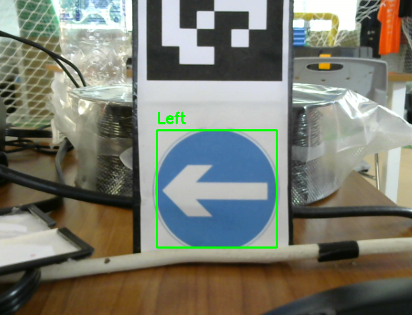

# 🚦 Traffic-Sign-Detection-OpenCV

A lightweight **traffic sign detection and classification** project built with **Python** and **OpenCV**.  
It uses **color + shape filtering** for candidate detection and a **HOG + SVM classifier** for recognition.  

🛠 Requirements
- Python 3.8+
- OpenCV
- scikit-image
- scikit-learn
- imutils
- numpy
- joblib

Install all requirements with:
pip install -r requirements.txt

🚀 How it Works
1. Training (model.py)
   - Loads images from dataset/ (one folder per class).
   - Extracts HOG (Histogram of Oriented Gradients) features.
   - Trains a Linear SVM classifier.
   - Saves the trained model as model.pkl.

2. Detection (detection.py)
   - Captures frames from webcam.
   - Converts them to HSV and applies color segmentation (red & blue).
   - Finds contours and filters by circularity.
   - Extracts HOG features from candidate ROIs.
   - Uses the trained SVM model to classify the sign.
   - Displays results in real-time with bounding boxes and labels.

▶️ Usage

1. Train the model
   Place your dataset inside the dataset/ folder (one subfolder per class).  
   Then run:
   python model.py

   This will train the classifier and save the model to model.pkl.

2. Run real-time detection
   python prueba.py

   Press "q" to quit.

📸 Example

